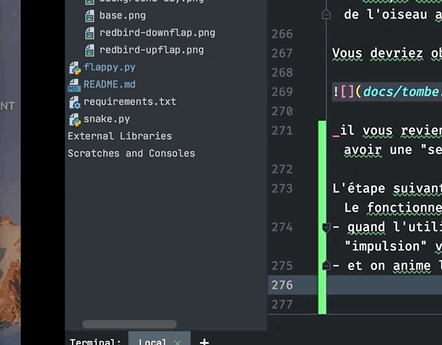

# Le flappy bird

Ce second exemple - pour les rapides - va nous permettre de nous confronter à un cas plus compliqué de jeu vidéo:
- l'espace de jeu n'est plus "discret": on n'avance plus case après case mais "continuement" à une vitesse donnée
- on va afficher des images et non des simples carrés de couleur
- on va devoir se poser la question de la collision entre l'oiseau et les éléments du décor


## Code de démarrage

Il est semblable au code de démarrage précédent:

```python
import pygame as pg

BG_BLUE = (0, 195, 204)

pg.init()
screen = pg.display.set_mode((640, 480))
clock = pg.time.Clock()

running = True
while running:
    clock.tick(30)

    # 1. lecture des évênements
    for event in pg.event.get():
        if event.type == pg.QUIT:
            running = False

    # 2. actions

    # 3. rendu
    screen.fill(BG_BLUE)
    pg.display.update()

pg.quit()
```

## À vous de jouer

La première action à mener est de dessiner notre oiseau (de malheur ?).
Pour dessiner une image en pygame, deux actions sont nécessaires:

- on doit charger l'image depuis un fichier, par ex.
  ```python
  image = pg.image.load("chemin/vers/image.png")
  ```
- puis on l'affiche, en donnant les coordonnées de son coin supérieur gauche:
  ```python
  # cette instruction va écraser ce qui se trouve en (100, 100) avec l'image
  screen.blit(image, (100, 100))
  ```

les images nécessaires sont disponibles ici
https://github.com/ue12-p21/python-advanced/tree/main/tps/games/images


vous devriez avoir un rendu semblable à celui-ci:


Il faut maintenant faire bouger notre oiseau.
Contrairement à l'exemple précédent, nous allons devoir utilisé un mouvement "continu", c'est à dire caractérisé par:
- l'accélération de la pesanteur (quelle unité ?)
- la vitesse de déplacement horizontale de l'oiseau (quelle unité ?)

Pour cela nous allons avoir besoin d'une notion de temps. Celle-ci va nous être donné par l'objet `clock` (plûtot logique !) qui retourne à chaque appel à `tick` le nombre de millisecondes écoulées depuis la dernière invocation, soit:

```python
# delta_ms contient le nombre de ms depuis la dernière invocation
delta_ms = clock.tick(30)
```

du coup l'algorithme a réaliser est le suivant:
- ajouter une variable pour la vitesse instantannées de l'oiseau
- une constant pour la gravité
- à chaque itération, mettez en jour la vitesse et la position de l'oiseau avant de l'afficher

Vous devriez obtenir quelque chose comme:


_il vous revient d'adapter les différentes constantes pour avoir une "sensation" de jeu agréable_


L'étape suivant est de définir une interraction avec l'oiseau. Le fonctionnement proposé est simple:
- quand l'utilisateur clique sur espace, l'oiseau reçoit une "impulsion" vers le haut qui va combattre la gravité
- et on anime l'oiseau en conséquence

Le résultat doit être semblable à:




## Lâchez-vous

à partir de là vous pouvez définir le reste, on vous invite à imaginer la suite...
