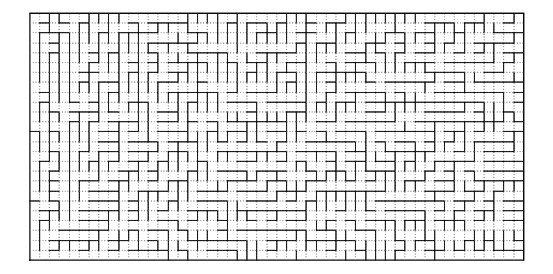

Labyrinthes
================================================================================

Un labyrinthe de taille 50 x 25 :



Ce labyrinthe est généré aléatoirement en respectant deux propriétés :

  - on peut explorer tout le labyrinthe quel que soit son point de départ,

  - si l'on rajoute un mur où que ce soit cette propriété disparaît.

Graphes
--------------------------------------------------------------------------------

Un graphe orienté et pondéré est représenté par le triplet composé :

  - d'un ensemble `vertices` de sommets,

  - d'un ensemble `edges` d'arêtes, représentées comme des paires de sommets,

  - d'un dictionnaire `weights` associant à chaque arête une valeur numérique.

Labyrinthes
--------------------------------------------------------------------------------

Un labyrinthe est une collection de cellules caractérisées par leurs coordonnées
(deux entiers positifs ou nuls) ainsi qu'une collection de murs entre
les cellules adjacentes (au nord, à l'est, au sud ou à l'ouest d'une cellule 
donnée) qui s'ajoutent aux murs entre l'intérieur et l'extérieur du labyrinthe.

Le graphe associé :

  - représente les cellules par la paire de leur coordonnées,

  - considère qu'une arête est présente dans le graphe si les deux cellules
    sont adjacentes, dans le labyrinthe et qu'aucun mur ne les sépare.

  - associe à chaque arête le poids 1 : le coût de l'action qui consiste à
    se déplacer d'une cellule à une cellule adjacente.

### Labyrinthes élémentaires

Développez une fonction `full_maze(width, height)` qui produit le graphe
d'un labyrinthe rectangulaire contenant la cellule `(0, 0)`, large de 
`width` cellules, haut de `height` cellules et contenant un mur entre
chaque paire de cellules adjacentes.

Puis, développez une fonction `empty_maze(width, height)` qui produit le
graphe rectangulaire similaire mais sans aucun mur interne.

### Visualisation

Utilisez la fonction `display_maze` dont le code est fourni en annexe de
ce document pour visualisez vos labyrinthes, par exemple :

``` pycon
>>> maze = full_maze(50, 25)
>>> display_maze(maze)
```

### Autres labyrinthes

Chargez et visualiser les labyrinthes disponible dans le dossier :
<https://github.com/boisgera/python-advanced-companion/tree/master/tps/graphs/mazes>

Le format de ces fichier est simplement la représentation `repr` du graphe
associé à un labyrinthe.


Chemins
--------------------------------------------------------------------------------

Performance
--------------------------------------------------------------------------------

Annexe - Visualisation
--------------------------------------------------------------------------------

```python
# Scientific stack
import numpy as np
import matplotlib as mpl
import matplotlib.pyplot as plt
import matplotlib.patches as patches

# Visualization
# ------------------------------------------------------------------------------
def wall(x1y1, x2y2):
    x1, y1 = x1y1
    x2, y2 = x2y2
    cx, cy = 0.5 * (x1 + x2), 0.5 * (y1 + y2)
    x3y3 = cx - (y1 - cy) + 0.5, cy + (x1 - cx) + 0.5
    x4y4 = cx - (y2 - cy) + 0.5, cy + (x2 - cx) + 0.5
    return x3y3, x4y4

def display_maze(graph, path=None, map=None):
    vertices, edges, weights = graph
    width = max(w for (w, h) in vertices) + 1
    height = max(h for (w, h) in vertices) + 1
    wh_ratio = width / height
    fig_width = 14  # inches
    fig_height = fig_width / wh_ratio
    fig, axes = plt.subplots(figsize=(fig_width, fig_height))
    axes.axis("equal")
    for x in range(width):
        for y in range(height):
            for (dx, dy) in [(-1, 0), (0, -1), (1, 0), (0, 1)]:
                xn, yn = x+dx, y+dy
                if ((x, y), (xn, yn)) in edges:
                    style = {"color": "grey", "linestyle": ":"}
                else:
                    style = {"color": "black", "linestyle": "-"}
                w1, w2 = wall((x, y), (xn, yn)) # wall segment                    
                axes.plot([w1[0], w2[0]], [w1[1], w2[1]], **style)
    axes.axis("off")

    if path:
        xs = np.array([x for (x, y) in path])
        ys = np.array([y for (x, y) in path])
        axes.plot(xs + 0.5, ys + 0.5, "r-")

    if map:
        if isinstance(map, set):
            map = {k: 1.0 for k in map}
        d_max = max(map.values())
        cmap = mpl.cm.get_cmap("viridis")

        for v, d in map.items():
            dx, dy = 1, 1
            rect = patches.Rectangle(v, dx, dy, facecolor=cmap(d / d_max))
            axes.add_patch(rect)
```